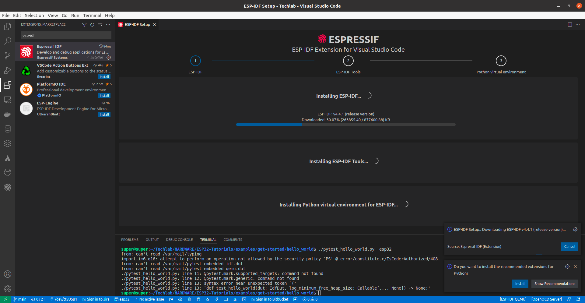

# ESP32-Tutorials

A collection of sample for working with ESP32 board

## Hardwares

- ESP32-WROOM-32 ([Based on ESP32-DevKitC V4](https://docs.espressif.com/projects/esp-idf/en/latest/esp32/hw-reference/esp32/get-started-devkitc.html))

## Quickstart

### Step 1: Standard Toolchain Setup for Linux and macOS

- https://docs.espressif.com/projects/esp-idf/en/latest/esp32/get-started/linux-macos-setup.html#standard-toolchain-setup-for-linux-and-macos

### VSCode Esp Idf extension

- https://github.com/espressif/vscode-esp-idf-extension
- https://github.com/espressif/vscode-esp-idf-extension/blob/master/docs/tutorial/install.md

## Reference

- [Official ESP-IDF Programming Guide](https://docs.espressif.com/projects/esp-idf/en/latest/esp32/get-started/index.html)